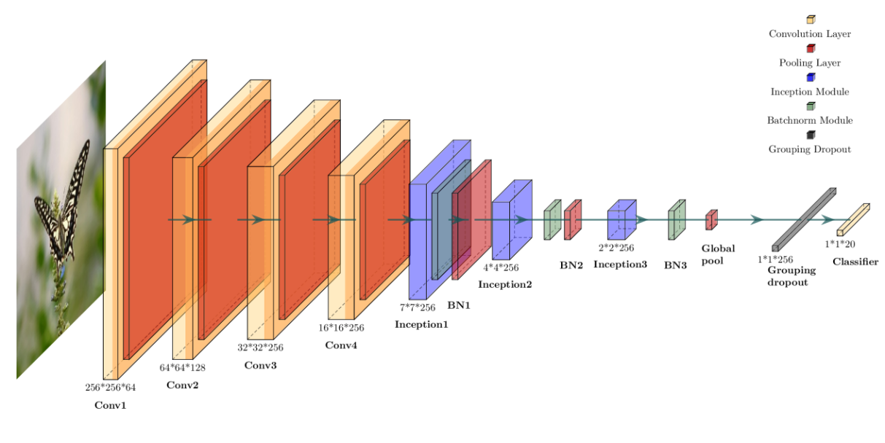
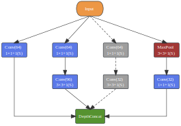
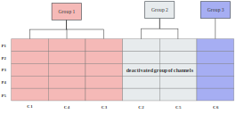

<a id="readme-top"></a>

[downloads]: https://img.shields.io/github/downloads/ZhijunBioinf/GDnet-IP/total.svg?style=social&logo=github&label=Download
[downloads-url]: https://github.com/ZhijunBioinf/GDnet-IP/releases
[stars-shield]: https://img.shields.io/github/stars/ZhijunBioinf/GDnet-IP.svg?style=flat-square&color=red
[stars-url]: https://github.com/ZhijunBioinf/GDnet-IP/stargazers
[forks-shield]: https://img.shields.io/github/forks/ZhijunBioinf/GDnet-IP.svg?style=flat-square&color=blue
[forks-url]: https://github.com/ZhijunBioinf/GDnet-IP/network/members

# GDnet-IP: Grouped Dropout-Based Convolutional Neural Network for Insect Pest Recognition</h1>

[![Downloads][downloads]][downloads-url]
[![Stargazers][stars-shield]][stars-url]
[![Forks][forks-shield]][forks-url]

## DESCRIPTION

We introduce a grouped dropout strategy and modify the CNN architecture to improve the accuracy of multi-class insect recognition. Leveraging the Inception module’s branching structure and the adaptive grouping properties of the WeDIV clustering algorithm, we developed two grouped dropout models, the iGDnet-IP and
GDnet-IP. Experimental results on a dataset containing 20 insect species (15 pests and five beneficial insects) with 73,635 images demonstrated an increase in cross-validation accuracy from 84.68% to 92.12%, with notable improvements in the recognition rates for difficult-to-classify species. Our model showed significant accuracy advantages over standard dropout methods on independent test sets, with much less training time compared to four conventional CNN models, highlighting the suitability for mobile applications.

<p style="float: center">
  
  <div align="center">(A)</div>
</p>
<p float="center">
  
  
</p>
<div>
  <span style="font-weight: bold;">&emsp;&emsp;&emsp;&emsp;&emsp;&emsp;&emsp;&emsp;&emsp;&emsp;(B)</span> &emsp;&emsp;&emsp;&emsp;&emsp;&emsp;&emsp;&emsp;&emsp;&emsp;&emsp;&emsp;&emsp;&emsp;&emsp;&emsp;&emsp;&emsp;&emsp;&emsp;&emsp;&emsp;&emsp;&emsp;&emsp;&emsp;
  <span style="font-weight: bold;">(C)</span>
</div>

<p align="left"><b>Grouped dropout-based CNN for insect pest recognition. (A) Architecture of GDnet-IP; (B) Inception-based GDnet-IP, where the grey branch is randomly deactivated; (C) Clustering-based GDnet-IP, where the channels in 'Group 2' are randomly deactivated.</b></p>

## Getting Started
### **Prerequisites**

- Python 3.7+
- Required libraries:
  - PyTorch
  - NumPy
  - SciPy
  - Pandas

### **Steps to Install**

1. Clone the repository:
  
  ```bash
  git clone https://github.com/ZhijunBioinf/GDnet-IP.git
  cd GDnet-IP
  ```
  
2. Install dependencies:
  
  ```bash
  pip install -r requirements.txt
  ```
  

<p align="right">(<a href="#readme-top">back to top</a>)</p>

## Usage

### **Prepare Your Dataset**

Organize your insect images into folders based on their class. For example:

```plaintext
data/
├── ants/
│   ├── image1.jpg
│   ├── image2.jpg
├── bees/
│   ├── image1.jpg
│   ├── image2.jpg
```

### **Perform k-fold cross validation using GDnet-IP model**

Just run the main function:

```bash
python GDnet-IP.py
```

<p align="right">(<a href="#readme-top">back to top</a>)</p>

## Contributors

This project was developed by:

- Dongcheng Li ([dongchengli287@gmail.com](mailto:dongchengli287@gmail.com)) - Implementing
- Zhijun Dai ([daizhijun@hunau.edu.cn](mailto:daizhijun@hunau.edu.cn)) - Supervisor

We welcome contributions from the community! Feel free to submit pull requests or raise issues.

<p align="right">(<a href="#readme-top">back to top</a>)</p>


## [Citation](https://www.mdpi.com/2077-0472/14/11/1915)

**Dongcheng Li, Yongqi Xu, Zheming Yuan, Zhijun Dai\*. GDnet-IP: Grouped Dropout-Based Convolutional Neural Network for Insect Pest Recognition. Agriculture, 2024, 14(11), 1915.**

<p align="right">(<a href="#top">back to top</a>)</p>
